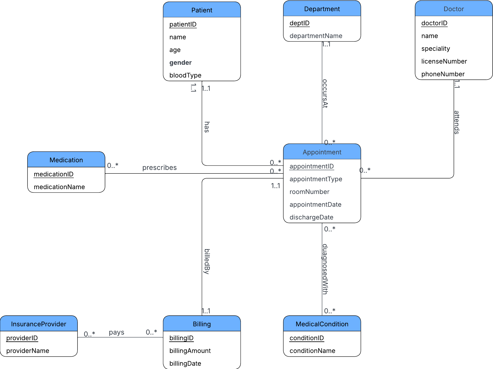

# Clinic-Management-Relational-Database-System

## Project Overview
This repository contains an end-to-end relational database system designed from an unnormalized healthcare dataset using Oracle SQL. The system models a multi-hospital clinical ecosystem, eliminating data redundancies, enforcing relational constraints, and extracting critical operational business intelligence.

## Schema Architecture
The database translates complex real-world clinical relationships into structured tables normalized to Third Normal Form (3NF). It handles many-to-many (M:N) mappings through junction tables:
* `Appointment_MedicalCondition` (Maps appointments to multiple diagnoses)
* `Appointment_Medication` (Maps appointments to multiple prescribed treatments)



## My Core Contributions (Yabo Detchou)
I completed the execution of core database programming segments, testing frameworks, and analytics logic within our team framework:

* **Entity Population**: Structured data injection and authored script populating 100% of rows for the core `Hospital` and `Appointment` relational tables.
* **Analytical Queries (Section 8.2)**: Designed and authored the multi-table aggregation logic to extract business indicators around physician workload constraints and disease frequency profiles.
* **Data Manipulation Operations (Section 9.2)**: Built programmatic maintenance scripts executing row-level updates and constraint-safe record deletions inside transactional environments.
* **Team Collaboration**: Assisted in schema drafting, relational constraint setup (`PRIMARY KEY`, `FOREIGN KEY`), and code merging.


## Sample Queries 

### 1. Doctor Caseload Ranking (Aggregation & Joins)
This query calculates total medical appointments assigned to each physician using a `LEFT JOIN` pattern to ensure comprehensive counting across staff rosters.
```sql
SELECT
    d.doctorID,
    d.name                      AS doctor_name,
    d.specialty,
    COUNT(a.appointmentID)      AS total_appointments
FROM   Doctor      d
LEFT JOIN Appointment a ON d.doctorID = a.doctorID
GROUP  BY d.doctorID, d.name, d.specialty
ORDER  BY total_appointments DESC;
```

### 2. Disease Profile Tracking (Multi-Table Infiltration)
This script penetrates an intersection table to isolate tracking for explicit medical condition frequencies (e.g., Asthma cases) per clinical provider.
```sql
SELECT
    d.doctorID,
    d.name                      AS doctor_name,
    d.specialty,
    mc.conditionName,
    COUNT(a.appointmentID)      AS case_count
FROM   Doctor                       d
JOIN   Appointment                  a         ON d.doctorID      = a.doctorID
JOIN   Appointment_MedicalCondition amc       ON a.appointmentID = amc.appointmentID
JOIN   MedicalCondition             mc        ON amc.conditionID = mc.conditionID
WHERE  mc.conditionName = 'Asthma'
GROUP  BY d.doctorID, d.name, d.specialty, mc.conditionName
ORDER  BY case_count DESC;
```

